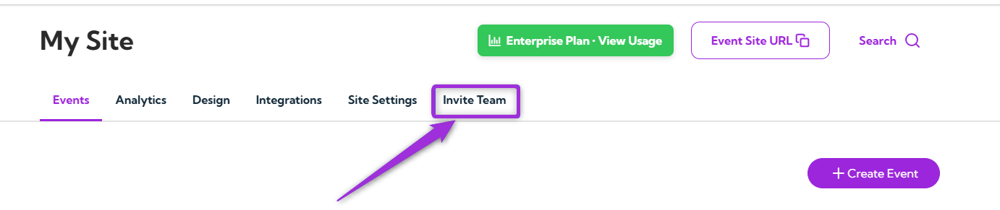
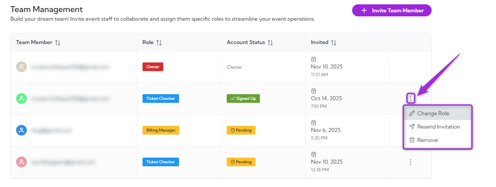
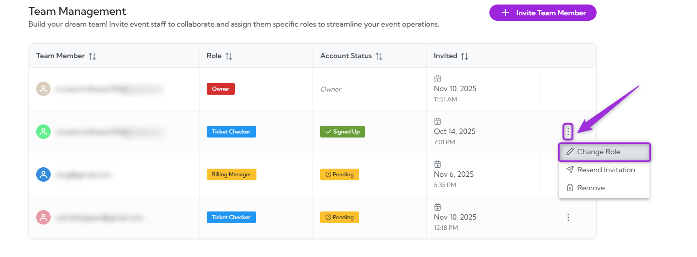
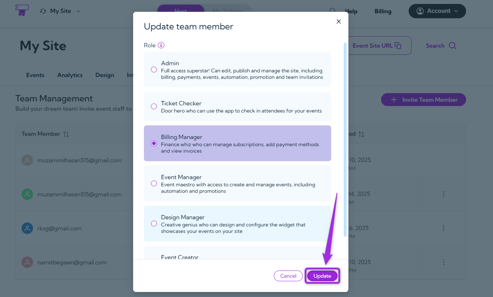
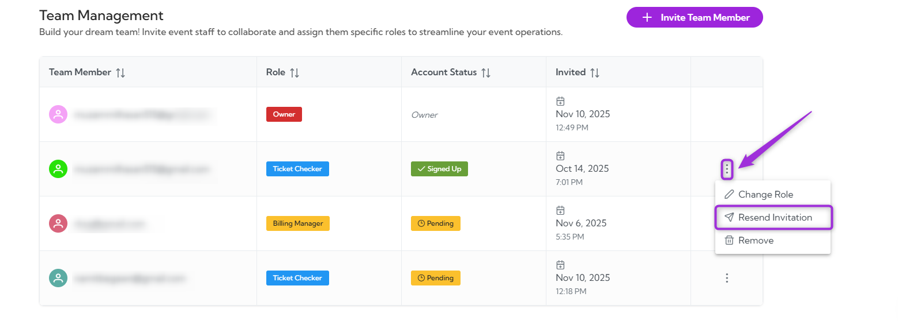
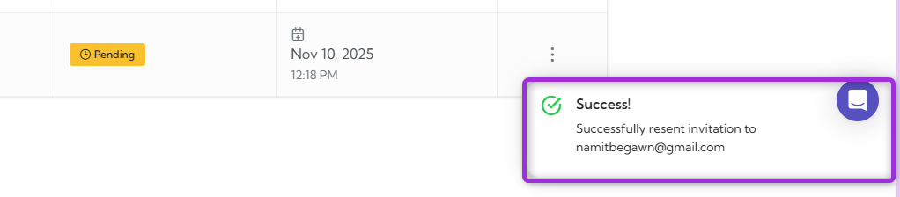
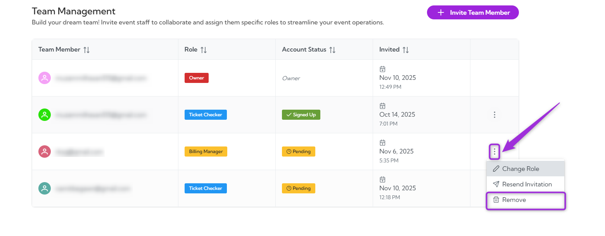
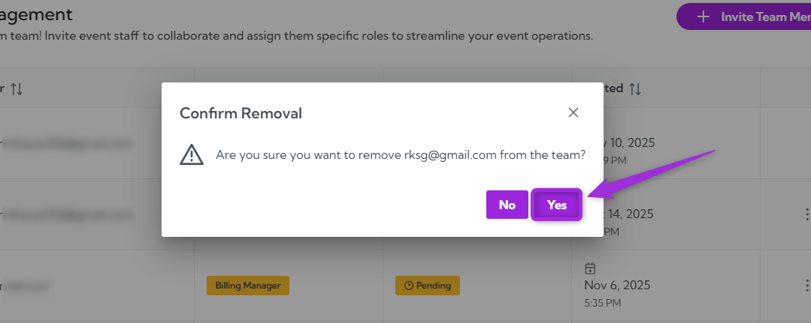
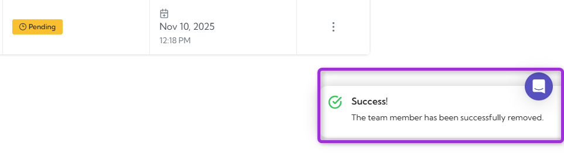

Managing invitations helps you control access, update roles, or remove users who haven’t joined yet. Each pending or active team member has a menu where you can take quick actions such as updating their role, resending their invite, or removing them from your team.

Let’s get started 🚀

**Step 1**: Log in to your **Ticket Spot** account and click on the **Invite Team** tab from the top navigation bar to open the team management page.

**Step 2**:Select the invitation you want to manage and click the vertical ellipsis (⋮) next to it to open the available actions.

## Change Role
Select **Change Role** to update the team member’s access. This option lets you assign a new role if their responsibilities change or if they need more (or less) permission within your Ticket Spot account.

1. Select **Change Role** from the list of options to update the member’s access level.

2. Choose the **new role** from the list to update the team member’s permissions, then click **Update** to save the changes.

## Resend Invitation
Use this option when a team member hasn’t accepted their invite or missed the original email.

1. Select **Resend Invitation** from the list of options to send a new invite link to the team member.

2. The system will resend the invitation to their email so they can join your team, and a confirmation message will appear once the invite is sent.

## Remove
Use this option to delete a pending or existing team member from your list and remove their access.

1. Select **Remove** from the list of options to delete the team member from your account.

2. A confirmation window will appear. Click **Yes** to remove the member or **No** to cancel the action.

A confirmation message will appear indicating that the team member has been successfully removed.

