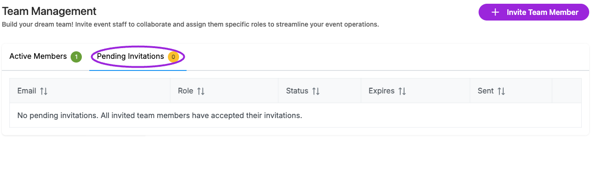

Open **Invite Team** for the selected workspace. Use the row's three-dot menu for actions; the available actions depend on whether the row is an active member or a pending invitation.

## Active Members

The table shows **Team Member**, **Role**, **Account Status**, and **Invited**. An account status of **Signed Up** or **Pending** describes account registration. It is separate from the dedicated pending-invitation list. The owner row is marked **Owner** and has no management menu.

<Frame caption="Invite Team separates Active Members from Pending Invitations. The owner row has no removal menu; personal email values are concealed.">
  
</Frame>

| Action | What happens |
|---|---|
| **Change Role** | Opens the role editor. Choose a role and select **Update**. |
| **Resend Invitation** | Sends the invitation email again. |
| **Remove** | Opens **Confirm Removal**. Confirm to remove the member's workspace access, or cancel to keep it. |

## Pending Invitations

The table shows **Email**, **Role**, **Status**, **Expires**, and **Sent**. Status identifies pending or expired invitations.

<Frame caption="Pending Invitations lists invitations awaiting acceptance, including their role and expiry status. This Demo site currently has no pending invitations.">
  
</Frame>

| Action | What happens |
|---|---|
| **Resend Invitation** | Sends another invitation to the listed email address. |
| **Delete** | Opens **Confirm Deletion** for the pending invitation. Confirm to remove it, or cancel to keep it. |

To invite someone with a new role, follow [Invite team members](./invite-team-roles). Deleting an invitation and removing an active member are different actions; check the tab and email before confirming.
